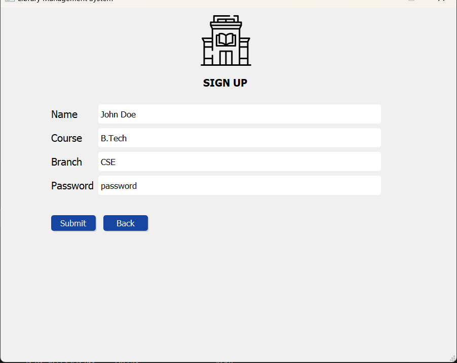
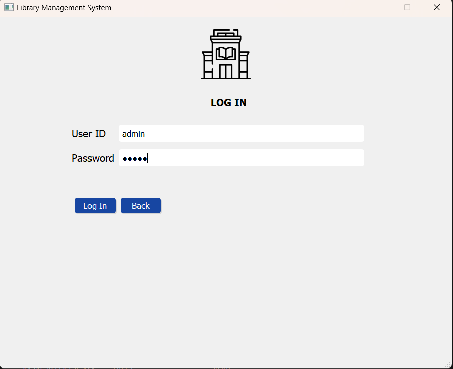
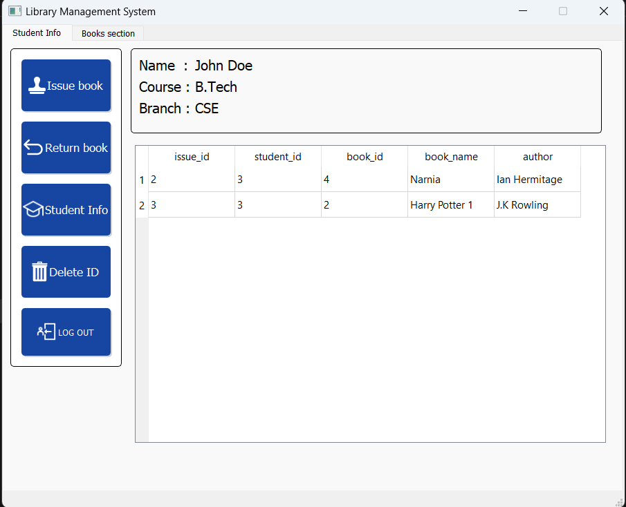
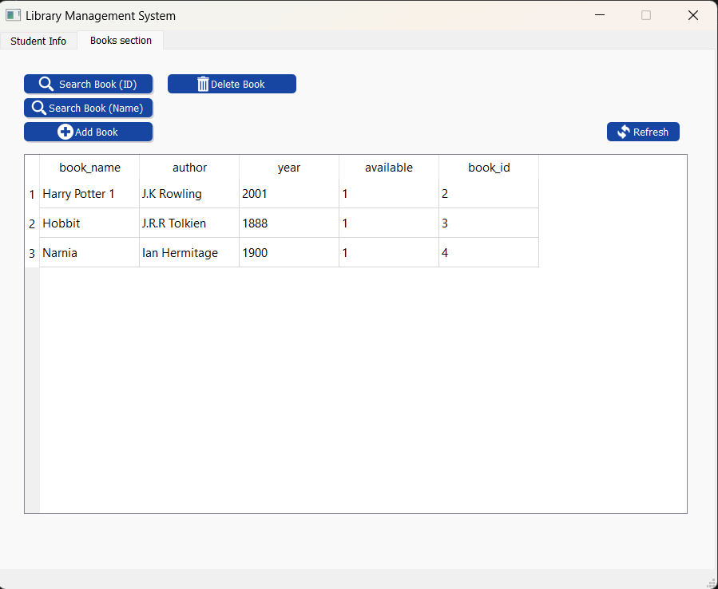
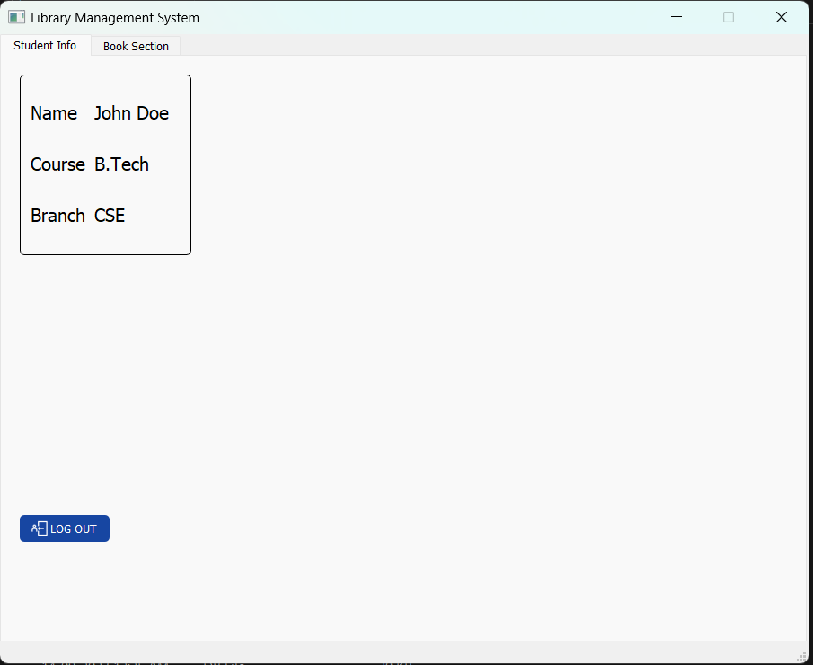
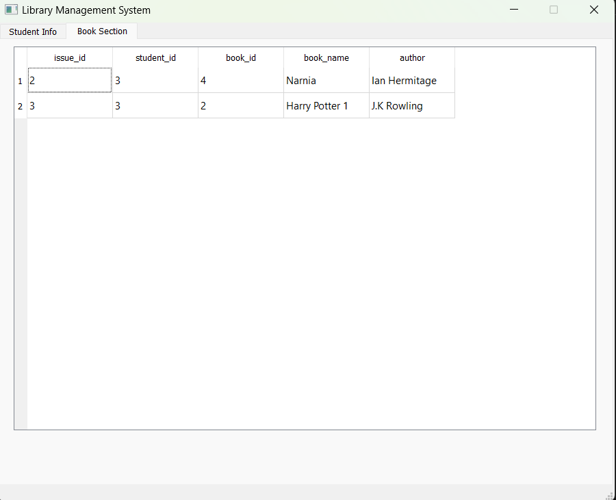

# Library-Management-System-Qt

A simple library management system made using Qt widgets.

## Screenshots

### Home Page

### Sign Up Page

### Login Page

### Admin Dashboard

### Books

### User Dashboard

### User Books

## Features

- Use of Qt Widgets for the user interface.
- Admin dashboard to add, search, delete, issue and return books.Also see student info and delete student.
- Student Dashboard to view details and issued books.
- Saving User data and books in local SQLITE database.

## How to Run

1. Clone this repository:

2. Open the project using Qt Creator or your preferred IDE.

3. Build and run the application.

## release

 release contains the executable and required dll files. You can run the game from there directly.

## Credits

This project was created by [Harshal Patil](https://github.com/harshal365247).

## License

This project is licensed under the [MIT License](LICENSE).

Feel free to explore, contribute.

